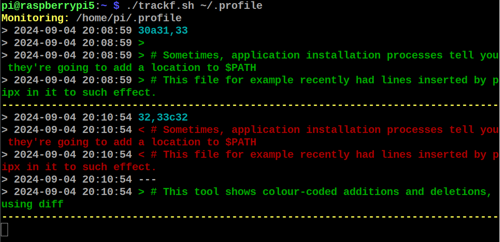

# `trackf` - A Simple Text File Change Tracker
BASH shell command that outputs lines that have changed in a text file, in real-time.

Compares a copy of the file in memory to the current content approximately every second.

Usage: `trackf <text-file>`

Use CTRL-C/CTRL-Z to interrupt.

## Installation (Debian / Ubuntu / Raspberry Pi OS)
[Download the latest .deb package](https://github.com/AnthonyRKing/trackf/releases/lates/download/trackf_latest_all.deb)

Then:

`sudo dpkg -i trackf_latest_all.deb`

